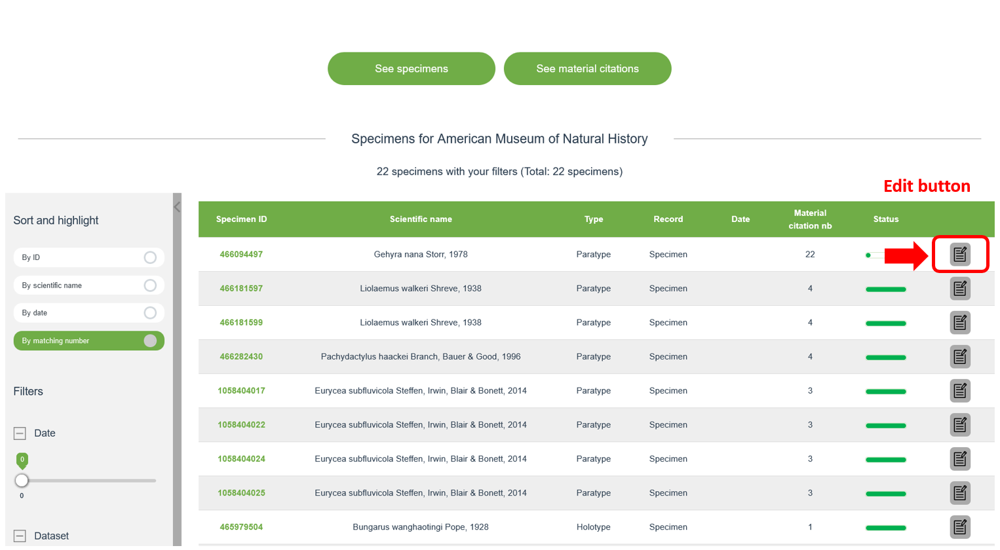
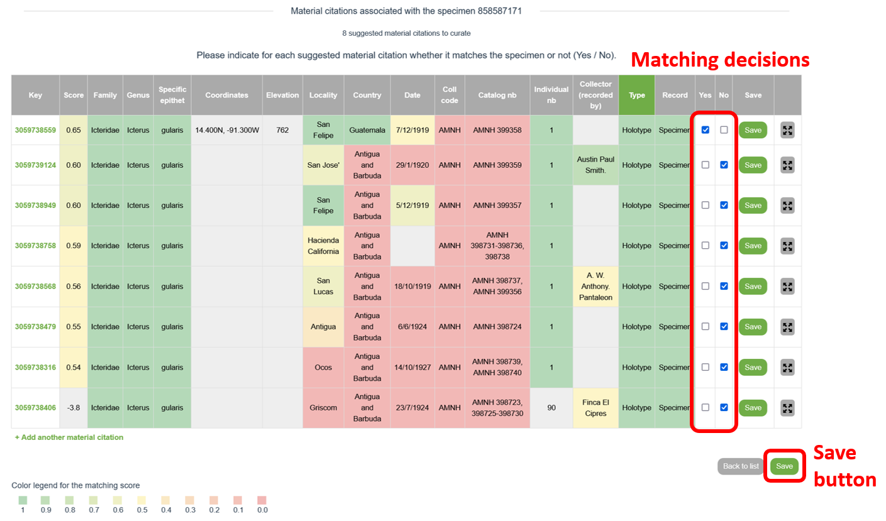
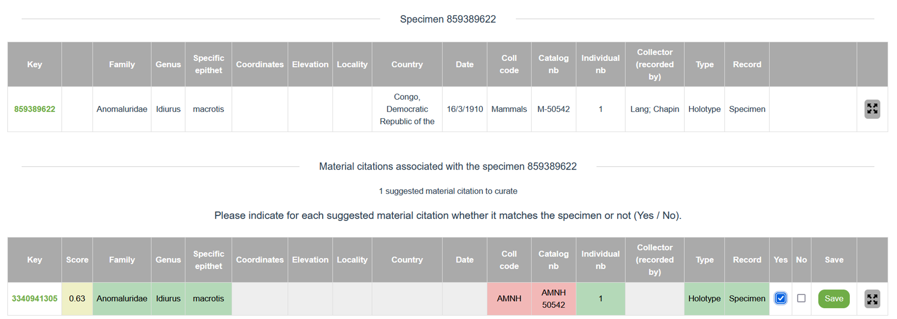
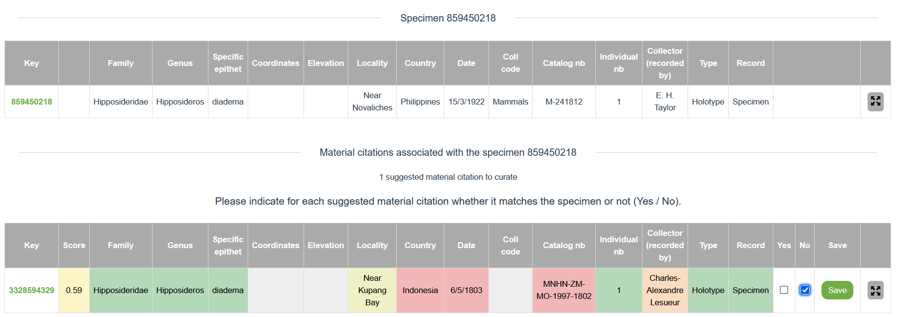

# Introduction to the matching service

The Earth’s scholarly knowledge about species diversity (biodiversity) is included in a corpus of several hundred million pages of academic publications spanning over 250 years, with an arbitrary starting point of 1753 for plants and 1758 for animals. These publications often contain references to biological specimens in natural history collections. In a digital world, access to this trove of biodiversity knowledge would be greatly enhanced if the references between the scholarly articles and the cited specimens were bidirectional and machine readable.

The **eBioDiv Matching Service** helps bridge this gap: The crowdsourcing tool allows users to match material citations contained in the academic literature to the respective specimens in natural history collections. To facilitate the task, a semi-automatic matching approach is used, where users are presented with lists of possible matches, along with matching scores indicating the probability of a match calculated by an [algorithm](matching_algorithm.md) developed for this purpose. Over time, the matching decisions taken by the users will be used as input to further refine the algorithm, thus increasing the efficiency of the tool.

!!! warning Disclaimer
    Note that the eBioDiv Matching Service and its documentation are still under development and is continuously updated; it may therefore well be that you will encounter some minor discrepancies between the text or the illustrations in this help section and the tool itself.

    {++In light green text++} referres to features that have not been implemented yet.

## Getting Started

To get started, click on the “Login” button in the top right corner to log in with your ORCID iD. If you do not have an ORCID iD yet, create one by registering [here](https://orcid.org/register).

{++On the start page, select your preferred way of accessing the matching service++}:

- {++**Country:** Select “Country” if you would like to match specimens that have been collected in a given country or region.++}
- **Institution:** Select “Institution” if you would like to match specimens held by a specific institution or that are part of a specific collection.
- {++**Taxon:** Select “Taxon” if you would like to match specimens belonging to a specific taxon or taxon group.++}
- {++**Article:** Select “Article” if you would like to match specimens that have been cited in a specific journal article.++}

In some cases, you will be asked to further refine your selection.

The selection contains specimens for which [data has been made available](data.md) on [GBIF.org](https://www.gbif.org/) and for which potentially corresponding material citations have been found in [scientific publications made available](data.md) through the [Plazi Treatment Bank](http://plazi.org/treatmentbank/).

You can decide whether you would like to do the matching of the selected items starting from a list of specimens or starting from a list of material citations. If you want, you can sort the selected items using different [sorting](occurrence_list.md) criteria or further refine your selection by using the [filters](occurrence_list.md) in the left sidebar.

In the table, click on the edit button on the right-hand side of the first item in order to open the matching screen (see screenshot).   

<figure markdown>
  
</figure>

## Matching Specimens with Material Citations
On the matching screen you are presented with the selected specimen (top row) and one or several material citations that are potentially matching the selected specimen.

*If you have chosen to do the matching starting from material citations instead of specimens, the top row will show a material citation instead of a specimen, and in the lower part you will be presented with a list of material citations that are potentially matching the selected material citation. The way the matching service works is the same, independently of whether you match items starting from a material citation or from a specimen..*

For each of the material citations presented in the list, decide whether it is matching the specimen indicated on the top and record your decision by selecting “Yes” (match), “No” (no match), or {++“Undecided”++} (see screenshot). If you are done, hit the “Save” button at the bottom.

<figure markdown>
  
</figure>

After hitting the “Save” button, click on “Back to list” just next to it in order to return to the initial overview table. From there, go to the item that is next on the list and record your matching decisions, and so on.

There are three possible outcomes your matching decisions can take:

1. **The material citation refers to the specimen** (“**Yes**, it is a match.”)

    If a given “material citation”-”specimen” pair is a match, select “Yes”.

    In the case of a match, a large majority of values in the data fields concerning the material citation should be identical with the values for the given specimen (indicated by green coloring).
    Note, however, that some discrepancies may exist in the data (indicated in red): for example due to inconsistencies in the representation of catalog numbers (see screenshot).    

    <figure markdown>
        
    </figure>

1. **The material citation does not refer to the specimen** (“**No**, it is not a match.”)

    If a given “material citation”-”specimen” pair clearly is no match, select “No”.

    In the case of no match, several values in the data fields concerning the material citation are usually different from the values for the given specimen (indicated by red or orange coloring).
    Note, however, that certain overlaps in the data usually exist (indicated in dark green); otherwise the given “material citation”-”specimen” pair would not have been suggested as a potential match in the first place (see: matching algorithm). Also, some fields that refer to completely different things in reality may still show up in light green color due to apparent similarities in the data (in the example in the screenshot, the locality indication contains in each case the word “Near”). 

    <figure markdown>
        
    </figure>

1. **It is unclear whether the material citation refers to the specimen** (“I leave it undecided.”)

    If you are unsure whether a given “material citation”-”specimen” pair is a match, do not take any decision (tick neither “Yes” nor “No”).

    If you look at the example in the screenshot, you will see that relatively few data are given in the material citation. While the two items have matching catalog numbers (the prefix “AMNH” refers to the institution), which usually would strongly indicate a match, the two items have two different collection dates. This may be due to a typo in the data, or it may refer to a different specimen. Given the fact that there is no additional data that would support our decision in this or the other way, we can leave it undecided whether the pair is a match or not and go back to the list without recording any decision.

    <figure markdown>
      
    </figure>
